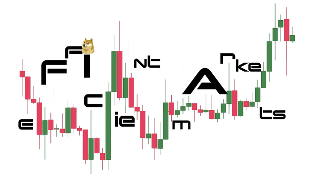
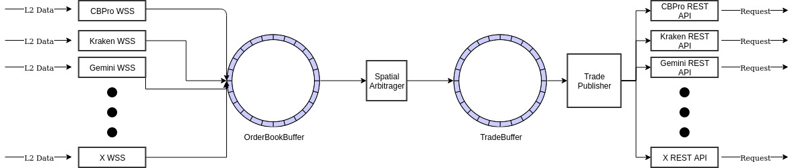

[](https://discord.gg/WUHBnh8m)

<p align="center">
    
</p>

# About

eFfiCieNTmaRkeTs is a Java application that performs cross-exchange, tri(but not limited to 3)-angular arbitrage, and
other realtime trading strategies in an attemptedly performant manner. 

Open source libraries used include [knowm/XChange](https://github.com/knowm/XChange) and [LMAX's Disruptor](https://github.com/LMAX-Exchange/disruptor).

## Supported Strategies

- Cross-exchange Arbitrage
- N-Angular Arbitrage (in-progress)
- DeFi-based Arbitrage strategies (in-progress)

## Supported Exchanges

- [x] CoinbasePro
- [x] Gemini
- [x] Kraken
- [ ] Binance
- [ ] Bitfinex
- [ ] Cex

## Setup

This application is intended to run with JDK8 or above. 
It's highly recommended that you use [Azul's Zing JVM](https://www.azul.com/software-downloads-and-documents/) to minimize GC performance impacts.

To configure the application to run with your API keys, environment variables need to be set accordingly.
Supported exchanges are listed under the ```exchange``` property in ```config.yaml```. 

The below example will enable CoinbasePro trading for 4 currency pairs, drawing credentials from 3 
environment variables, ```COINBASEPRO_API_KEY```, ```COINBASEPRO_SECRET_KEY```, ```COINBASEPRO_PASSPHRASE```.

```  
coinbase_pro:
    enabled: true
    websocket:
      depth: 10
      currency_pairs:
        - "BTC_USD"
        - "ETH_USD"
        - "LTC_USD"
        - "ETH_BTC"
    api:
      refresh_rate: 60
      credentials:
        api_key: "${env:COINBASEPRO_API_KEY}"
        secret_key: "${env:COINBASEPRO_SECRET_KEY}"
        passphrase: "${env:COINBASEPRO_PASSPHRASE}"
```

## User Commands
After the application has successfully started and is receiving market data through exchange websockets, you may control
its behavior through a TCP connection. 

Connecting via netcat: 

```netcat 127.0.0.1 3575```

Command Reference:
```
1 - Shutdown Application
2 - Rebalance to USD
```

## Application Architecture



## Exchange Specific Notes
Placeholder section for any anomalous exchange trading details, e.g. 
which exchanges don't charge fees against the quote currency.

## Features In Development
- [ ] Session Metrics/Event Logging